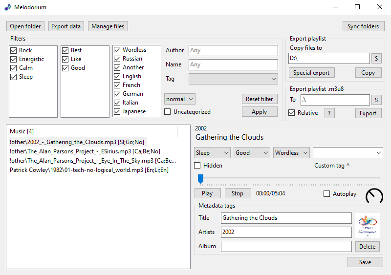
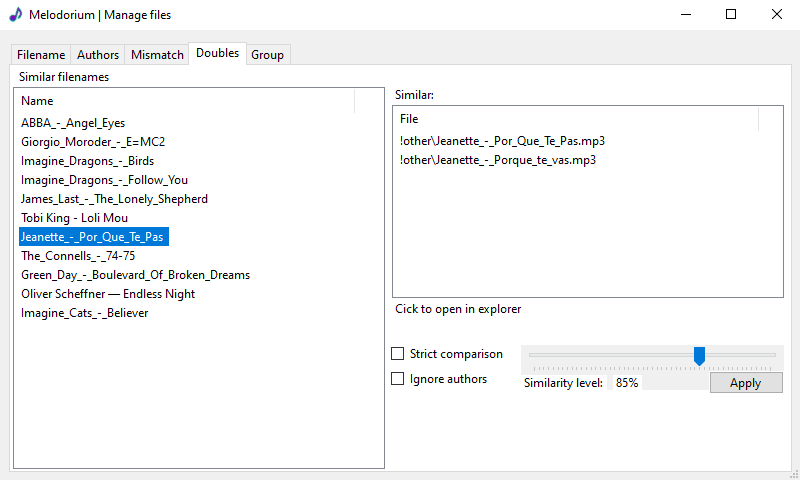
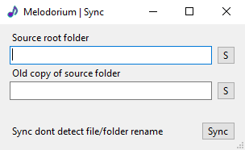

# Melodorium

### [Download / Скачать [v1.0] (Windows)](https://github.com/MixelTe/Melodorium/releases/download/v1.0/Melodorium.exe)
App for categorizing music

Приложение для классификации музыки по категориям

---

Features:
* Categorize by mood, like, language and custom tag
* Export filtered playlist to .m3u8 or folder with files
* Manage files
	* Rename files to one style
	* Find mistakes in grouping by author per folder
	* Find doubles by filename
* Sync folders - can sync the contents of any two folders

Возможности:
* Категоризация по энергичности, любви, языку и пользовательским тегам.
* Экспорт отфильтрованного плейлиста в .m3u8 или папку с файлами
* Управление файлами
	* Переименовать файлы в один стиль
	* Поиск ошибок в группировке по автору в папке
	* Поиск дублей по имени файла
* Синхронизация папок - можно синхронизировать содержимое любых двух папок

